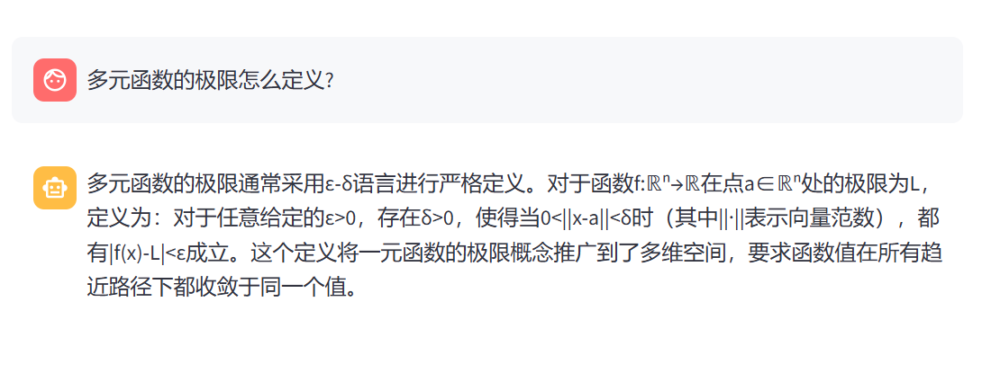
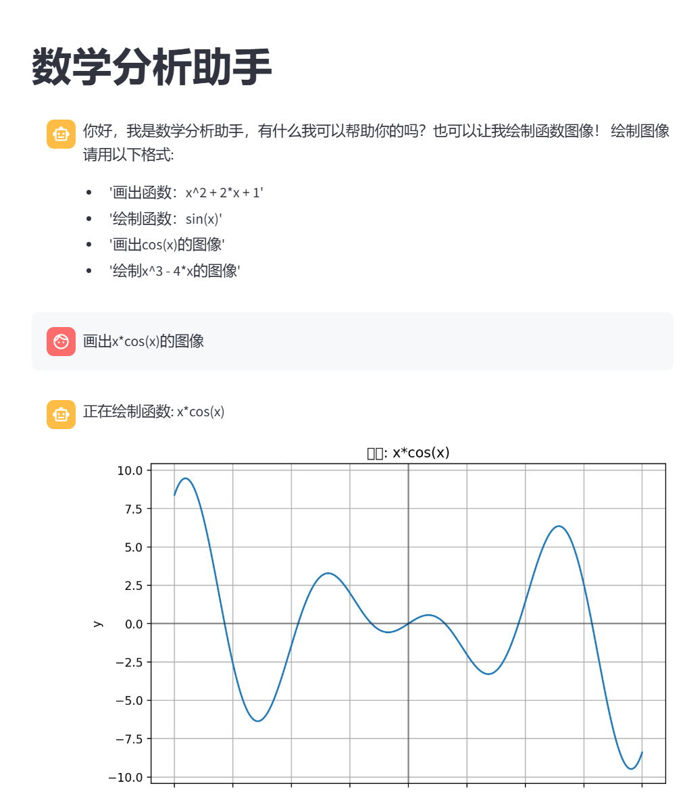

# 数学分析助手 - 使用说明

## 概述

数学分析助手是一个基于Streamlit和LlamaIndex构建的智能应用，能够回答数学分析相关的问题并绘制函数图像。该应用结合了大型语言模型的自然语言处理能力和数学函数可视化功能，为用户提供便捷的数学学习工具。

## 功能特点

1. **数学问题解答**：回答数学分析相关的问题
2. **函数图像绘制**：支持绘制各种数学函数的图像
3. **自然语言交互**：使用自然语言提问或请求绘制函数
4. **对话历史记录**：保存完整的对话历史

## 安装与运行

### 前提条件

- Python 3.8+
- pip包管理工具
- linux环境

### 安装步骤

1. 克隆或下载项目代码
   ```bash
   cd /root
   git clone https://github.com/satoshinji2992/math_agent.git
   cd math_agent
   ```
2. 安装依赖包：
   ```bash
   pip install -r requirements.txt
   ```
3. 安装词嵌入模型:
   ```bash
   python download_hf.py
   ```

### 运行应用

```bash
streamlit run app.py
```

应用将默认在本地8501端口运行，可通过浏览器访问 `http://localhost:8501`。

## 使用说明

### 基本使用

1. 在底部输入框中输入您的数学问题或绘图请求
2. 按Enter键或点击发送按钮提交问题
3. 系统将生成回答或绘制函数图像

### 函数图像绘制

您可以使用以下格式请求绘制函数图像：

- "画出函数：x^2 + 2*x + 1"
- "绘制函数：sin(x)"
- "画出cos(x)的图像"
- "绘制x^3 - 4*x的图像"

### 侧边栏功能

- **清除聊天历史**：点击"Clear Chat History"按钮可重置对话

### 示例



## 配置说明

### API配置

应用使用DeepSeek API作为LLM后端，如需更改API设置，可修改.env中的内容：

```python
api_base_url = "https://api.deepseek.com"
model = "deepseek-chat"
api_key = "sk-7b19e7331bb0476d90e099e618ade2e0"
```

### 数据目录

默认数据目录为 `/root/llamaindex_demo/data`，如需更改请修改：

```python
documents = SimpleDirectoryReader("/root/math_agent/data").load_data()
```

### 嵌入模型

使用HuggingFace的sentence-transformer模型，路径为 `/root/model/sentence-transformer`，需要通过运行`download_hf.py`下载

## 安全注意事项

1. 请妥善保管API密钥，不要公开分享
2. 函数绘制功能使用eval()执行用户输入，请确保在可信环境中运行

## 常见问题

**Q: 为什么我的函数图像无法绘制？**
A: 请检查函数表达式是否正确，并确保使用支持的数学函数（如sin, cos, exp等）

**Q: 如何更改绘图的x轴范围？**
A: 可在代码中修改plot_function函数的x_range参数

**Q: 响应速度慢怎么办？**
A: 可以尝试减少num_points参数值或使用更简单的函数表达式

## 贡献与反馈

如有任何问题或建议，欢迎提交issue或联系开发者。# math_agent
